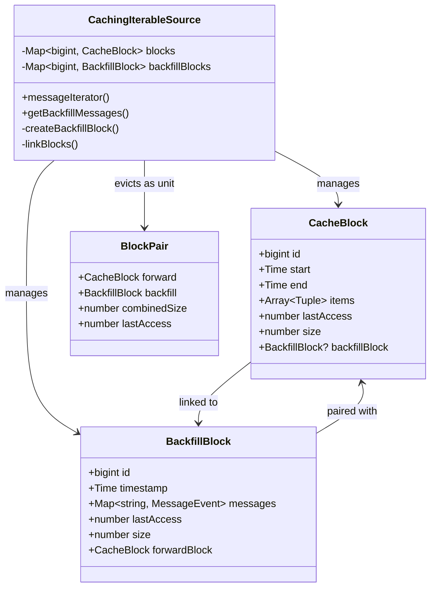
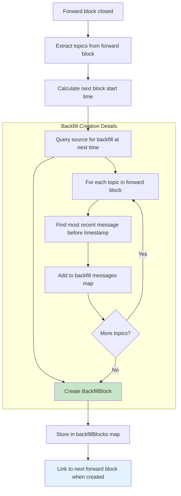
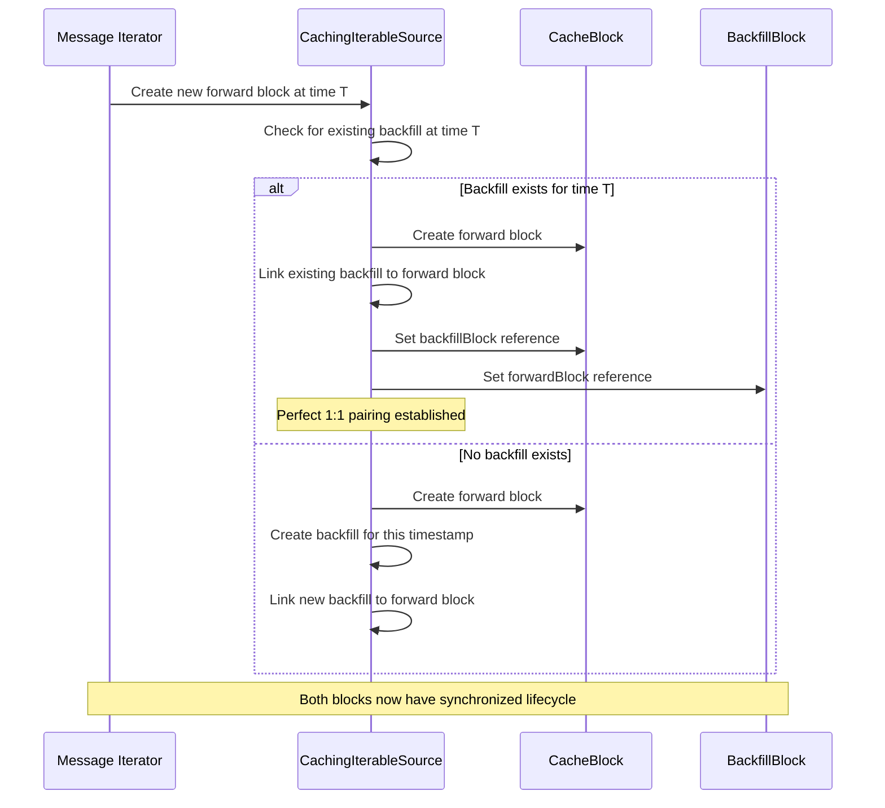
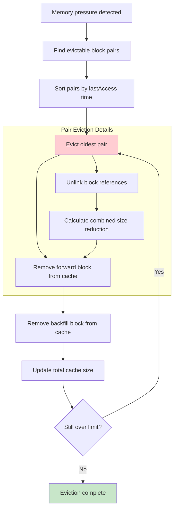
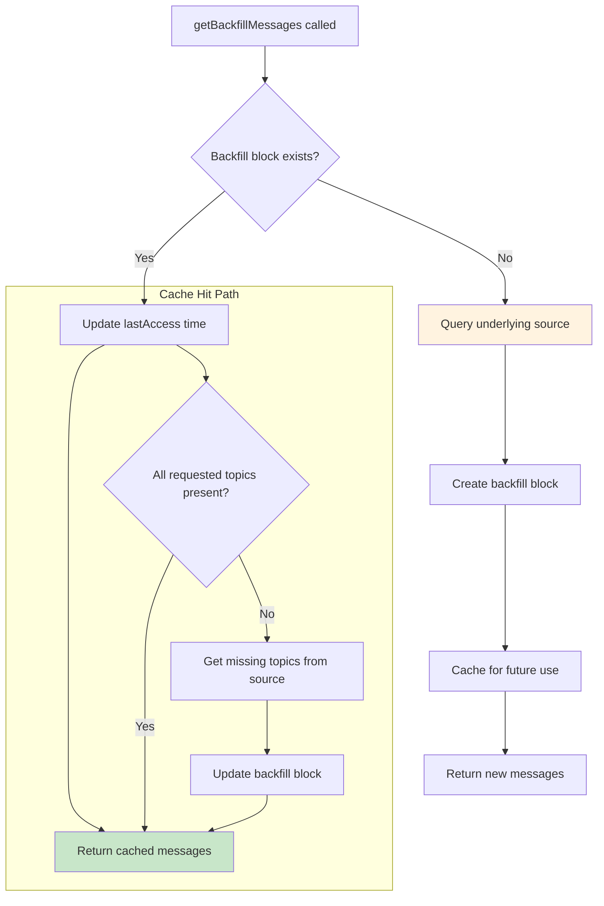
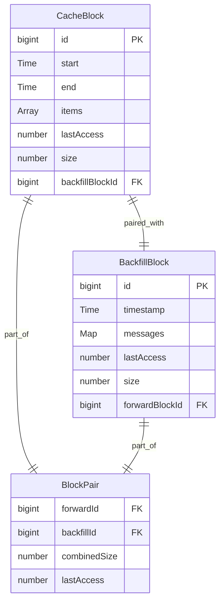
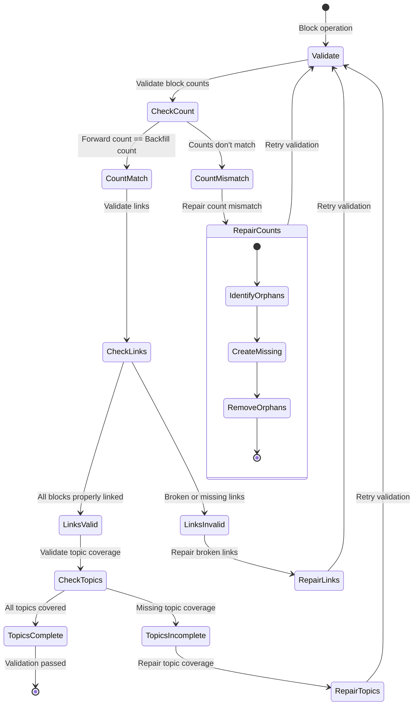
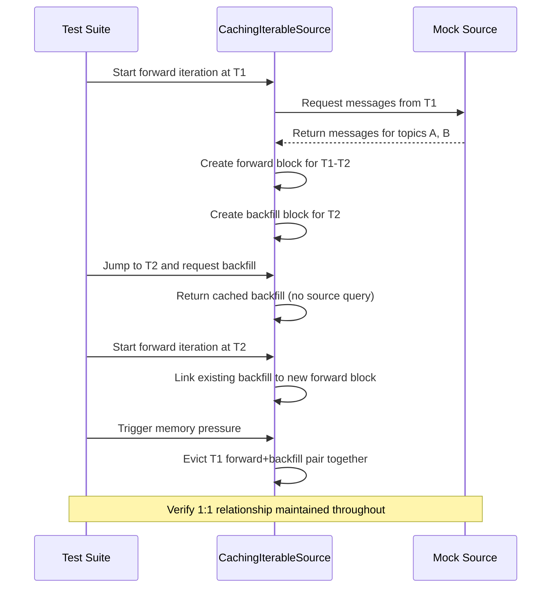

# Design Document

## Overview

This design enhances the `CachingIterableSource` to implement a synchronized backfill cache system where each forward iteration block has exactly one corresponding backfill block. The backfill blocks contain the most recent messages for all topics at the start time of their paired forward block, enabling efficient time-based navigation and seamless transitions between backfill and forward iteration.

## Architecture

### Core Components



### Data Structures

#### BackfillBlock Structure

```typescript
interface BackfillBlock {
  id: bigint; // Unique identifier
  timestamp: Time; // Exact timestamp (start of forward block)
  messages: Map<string, MessageEvent>; // Most recent message per topic
  lastAccess: number; // For LRU eviction
  size: number; // Memory footprint in bytes
  forwardBlock: CacheBlock; // Reference to paired forward block
}
```

#### Enhanced CacheBlock

```typescript
interface CacheBlock {
  // ... existing fields
  backfillBlock?: BackfillBlock; // Reference to paired backfill block
}
```

## Components and Interfaces

### BackfillBlock Management

#### Creation Algorithm



#### Linking Strategy



### Memory Management

#### Synchronized Eviction



#### Size Calculation

```typescript
interface MemoryCalculation {
  forwardBlockSize: number; // Size of forward block messages
  backfillBlockSize: number; // Size of backfill messages
  combinedSize: number; // Total pair size
  overhead: number; // Metadata and reference overhead
}
```

### Enhanced API Methods

#### getBackfillMessages Enhancement



## Data Models

### Block Relationship Model



### Topic Coverage Model

```mermaid
graph TD
    subgraph "Forward Block Topics"
        FT1[Topic A]
        FT2[Topic B]
        FT3[Topic C]
    end

    subgraph "Backfill Block Messages"
        BM1[Topic A: Most recent message before start time]
        BM2[Topic B: Most recent message before start time]
        BM3[Topic C: Most recent message before start time]
    end

    FT1 -.-> BM1
    FT2 -.-> BM2
    FT3 -.-> BM3

    subgraph "Guarantee"
        Guarantee[Every topic in forward block has corresponding backfill message]
    end

    style Guarantee fill:#e8f5e8
```

## Error Handling

### Consistency Validation



### Recovery Strategies

```typescript
interface RecoveryStrategy {
  detectInconsistency(): InconsistencyType;
  repairCountMismatch(): void;
  repairBrokenLinks(): void;
  repairTopicCoverage(): void;
  validateConsistency(): boolean;
}

enum InconsistencyType {
  COUNT_MISMATCH = "count_mismatch",
  BROKEN_LINKS = "broken_links",
  INCOMPLETE_TOPICS = "incomplete_topics",
  MEMORY_LEAK = "memory_leak",
}
```

## Testing Strategy

### Unit Tests

#### Block Pairing Tests

```typescript
describe("BackfillBlock Pairing", () => {
  test("creates backfill block when forward block is closed", () => {
    // Test automatic backfill creation
  });

  test("maintains 1:1 relationship between blocks", () => {
    // Test count invariant
  });

  test("links blocks with correct references", () => {
    // Test bidirectional linking
  });

  test("includes all forward block topics in backfill", () => {
    // Test topic coverage
  });
});
```

#### Eviction Tests

```typescript
describe("Synchronized Eviction", () => {
  test("evicts forward and backfill blocks together", () => {
    // Test atomic eviction
  });

  test("updates memory calculations correctly", () => {
    // Test size accounting
  });

  test("maintains consistency after eviction", () => {
    // Test post-eviction state
  });
});
```

### Integration Tests

#### End-to-End Workflow



### Performance Tests

#### Memory Efficiency

```typescript
describe("Memory Management", () => {
  test("backfill blocks do not exceed memory limits", () => {
    // Test memory bounds
  });

  test("eviction maintains performance under pressure", () => {
    // Test eviction performance
  });

  test("cache hit rates improve with backfill caching", () => {
    // Test performance improvement
  });
});
```

## Implementation Phases

### Phase 1: Core Data Structures

- Implement `BackfillBlock` interface
- Add backfill block storage to `CachingIterableSource`
- Create block linking mechanisms
- Add basic validation

### Phase 2: Block Lifecycle Management

- Implement synchronized creation
- Add automatic backfill generation on forward block close
- Implement bidirectional linking
- Add topic coverage validation

### Phase 3: Memory Management Integration

- Integrate backfill blocks into eviction algorithm
- Implement synchronized eviction
- Add combined size calculations
- Update memory pressure handling

### Phase 4: API Enhancement

- Enhance `getBackfillMessages` to use cache
- Update access time tracking
- Add cache hit/miss metrics
- Implement consistency validation

### Phase 5: Testing and Optimization

- Comprehensive test suite
- Performance benchmarking
- Memory usage optimization
- Error handling refinement

This design ensures that backfill blocks maintain perfect synchronization with forward blocks while providing efficient caching and memory management for robotics data visualization scenarios.
