# CachingIterableSource Algorithm Documentation

## Overview

The `CachingIterableSource` is a sophisticated caching layer that sits between the Lichtblick player and underlying data sources (like ROS bags, MCAP files, etc.). It implements an intelligent memory-based caching system that optimizes data access patterns for robotics visualization and playback scenarios.

## Core Architecture

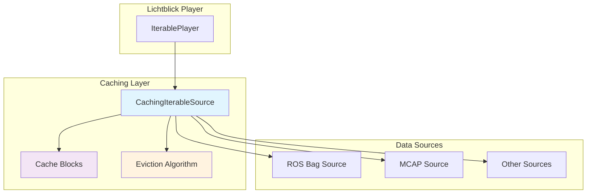

## Cache Block Structure

Each cache block represents a continuous time range of messages and contains:

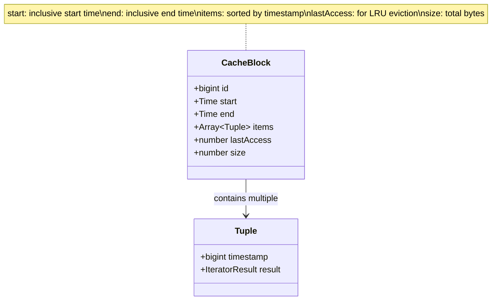

## Message Iterator Algorithm

The core message iteration follows this sophisticated flow:

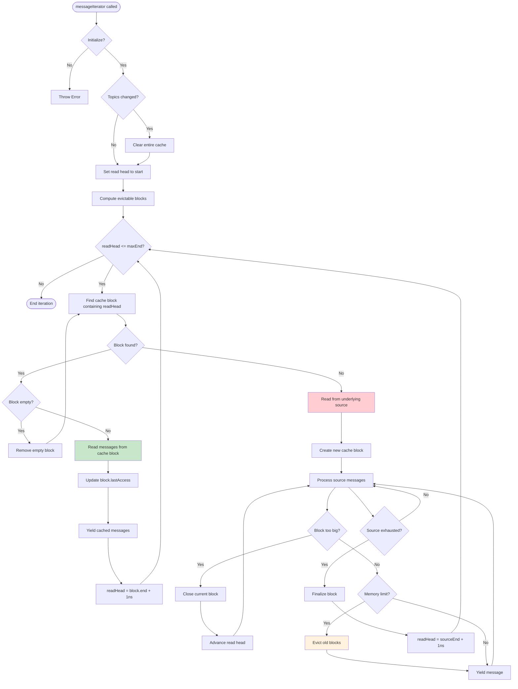

## Cache Block Management

### Block Creation and Insertion

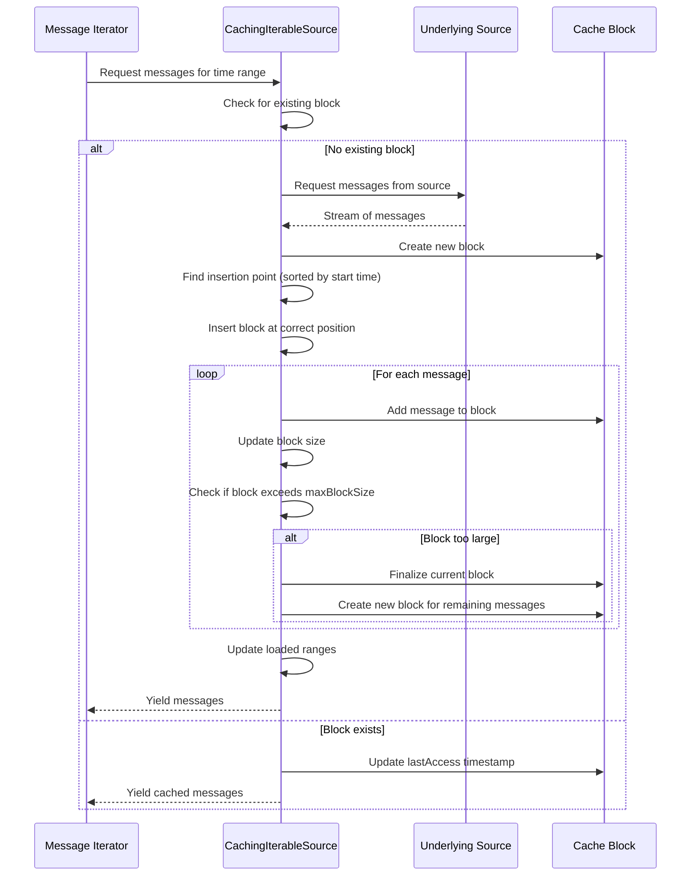

### Time-based Block Boundaries

The algorithm carefully manages block boundaries based on message timestamps:

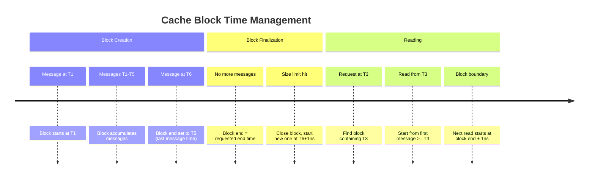

## Memory Management and Eviction

### Eviction Algorithm

The cache uses a sophisticated eviction strategy that considers both temporal locality and memory pressure:

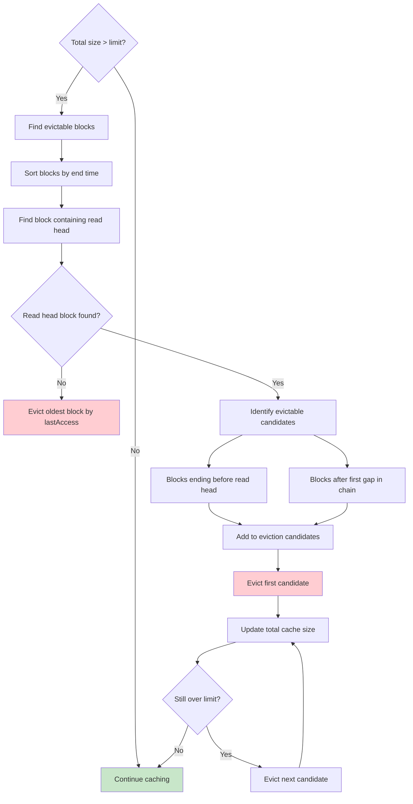

### Evictable Block Identification

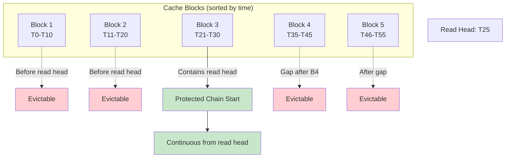

## Backfill Algorithm

The backfill mechanism retrieves the most recent message per topic before a given timestamp:

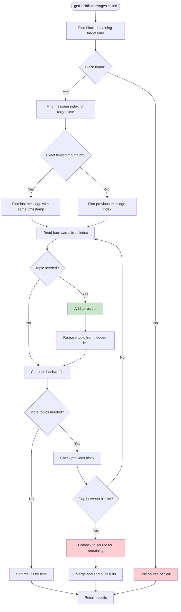

## Cache Coherency and Loaded Ranges

The system maintains accurate loaded range information for UI progress indicators:

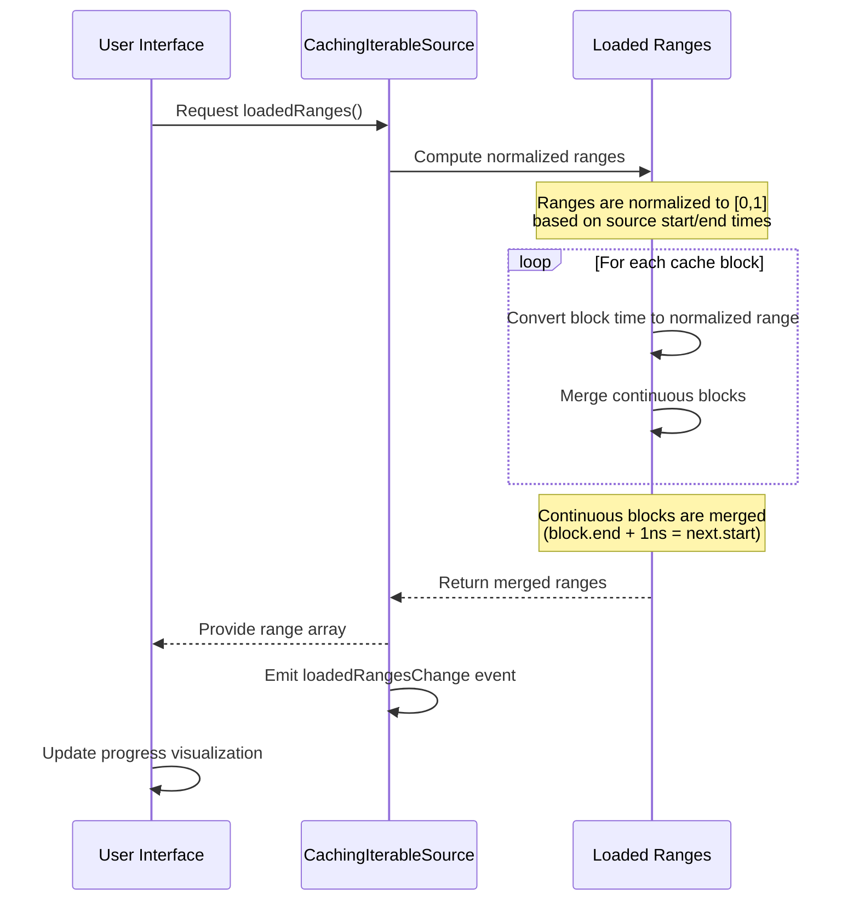

## Performance Optimizations

### Binary Search for Message Lookup

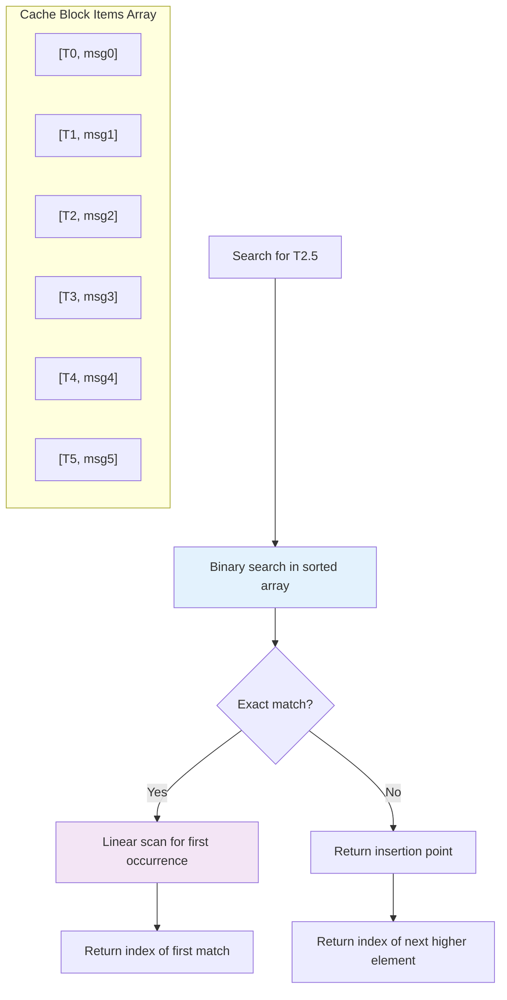

### Consecutive Block Access Optimization

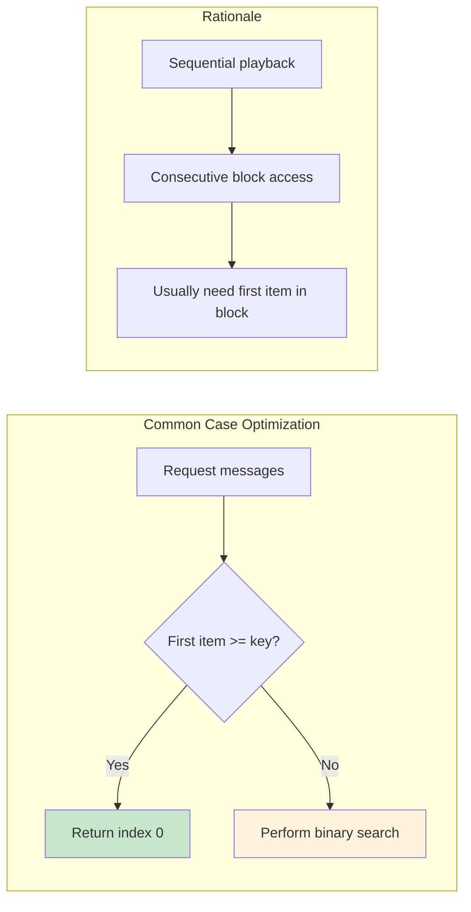

## Configuration Parameters

The caching behavior is controlled by several key parameters:

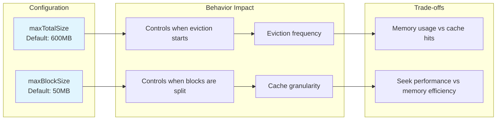

## Error Handling and Edge Cases

### Topic Change Handling

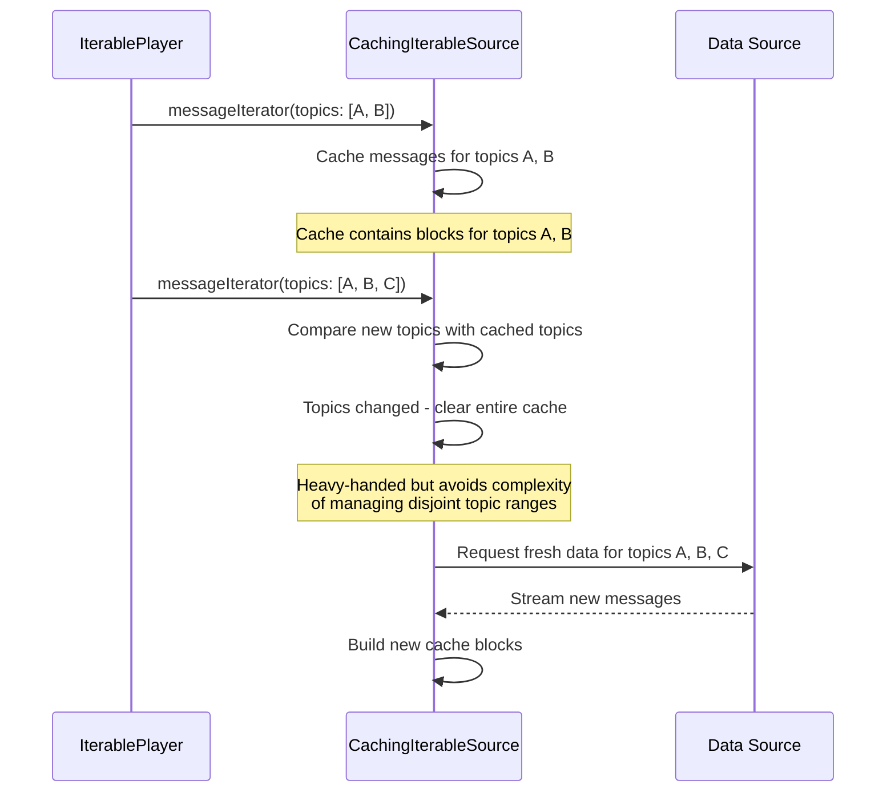

### Memory Pressure Scenarios

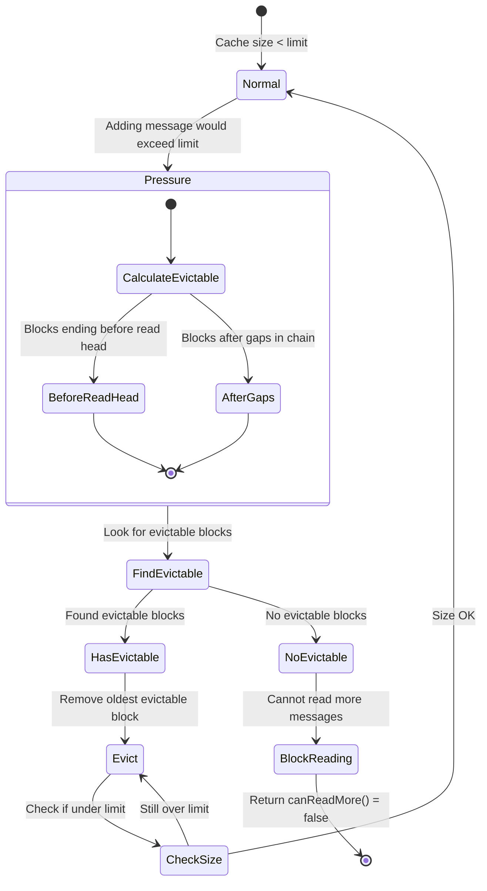

## Integration with Lichtblick Player

The caching source integrates seamlessly with the broader Lichtblick architecture:

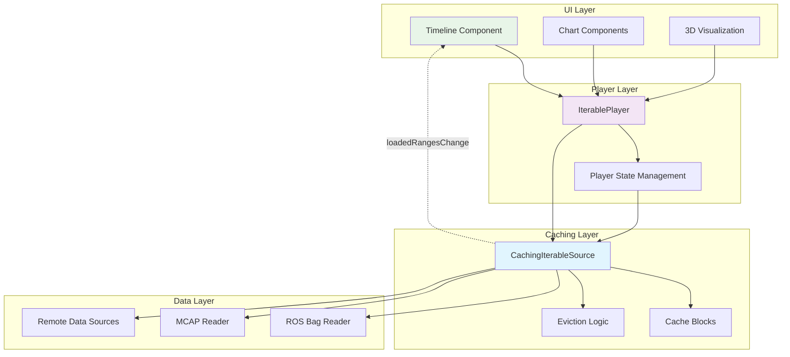

## Performance Characteristics

### Time Complexity

| Operation                   | Best Case | Average Case | Worst Case |
| --------------------------- | --------- | ------------ | ---------- |
| Message Iterator (cached)   | O(1)      | O(log n)     | O(n)       |
| Message Iterator (uncached) | O(m)      | O(m + log n) | O(m + n)   |
| Backfill (cached)           | O(log n)  | O(log n + k) | O(n)       |
| Block Eviction              | O(1)      | O(b)         | O(b)       |
| Cache Lookup                | O(1)      | O(log b)     | O(b)       |

Where:

- n = messages per block
- m = messages to read from source
- k = number of topics for backfill
- b = number of cache blocks

### Space Complexity

The cache uses O(M) space where M is the configured maximum cache size. The actual memory usage includes:

- Message data: Variable based on message sizes
- Block metadata: O(b) where b is number of blocks
- Index structures: O(n) where n is total cached messages
- Loaded ranges: O(b) for range computation

This sophisticated caching algorithm provides excellent performance for typical robotics data access patterns while maintaining bounded memory usage and providing mechanisms for cache coherency and eviction under memory pressure.
